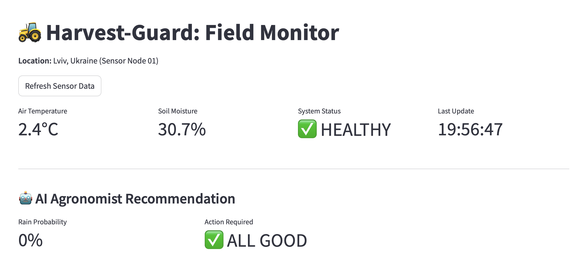
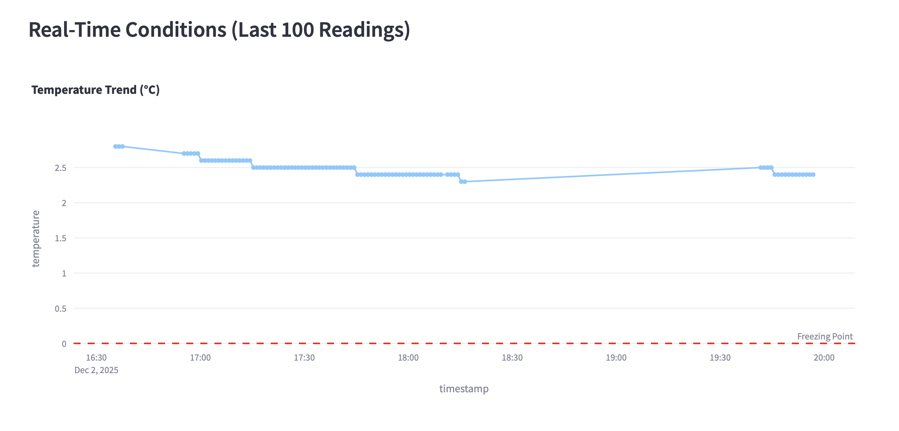
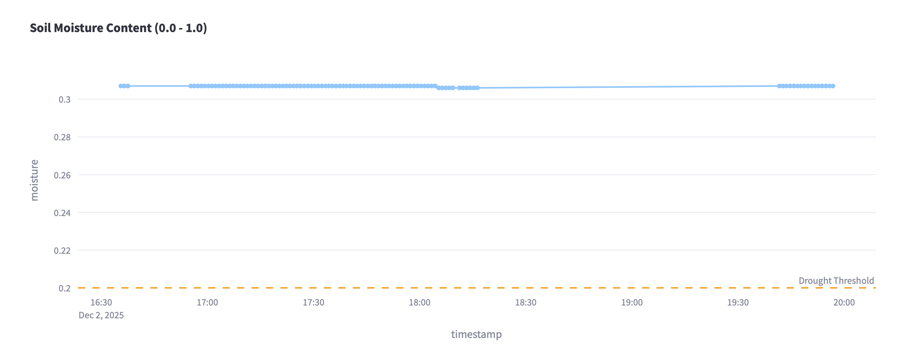
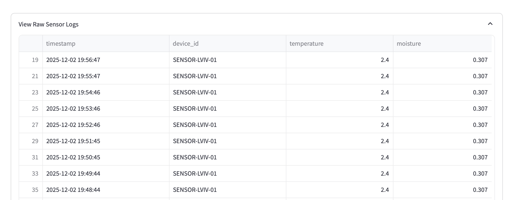

# 🚜 Harvest-Guard: Industrial IoT Field Monitor

### *Cloud-Native Remote Monitoring System for Agriculture*

**Live Dashboard:** [Link to your Streamlit App](https://harvest-guard.streamlit.app)

---

## 🚀 The Mission
Modern agriculture requires precision. **Harvest-Guard** is an Industrial IoT (IIoT) pipeline designed to remotely monitor field conditions in Ukraine, analyze soil health, and provide automated irrigation recommendations based on real-time weather forecasts.

**The Tech Pivot:** This project adapts high-frequency financial engineering principles (from my [Crypto Volatility Pipeline](https://github.com/znodanilo2017-byte/crypto-sentinel-pipeline)) to the agricultural domain, proving that robust data engineering is domain-agnostic.

## 🧠 Smart Features
* **Real-Time Telemetry:** Simulates IoT sensor nodes sending Temperature & Soil Moisture data every 60s.
* **Frost Guard:** Automated alerts via Telegram if temperature drops below freezing (0°C).
* **AI Agronomist:** A logic engine that combines **Soil Moisture** data with **Precipitation Probability** to recommend actions (e.g., *"Don't water, rain is coming"*).

## 🏗️ Architecture
1.  **Sensor Node (Edge):** Python client polling **Open-Meteo API** (simulating hardware sensors).
2.  **Transport:** Data shipped securely via **Docker** containers on **AWS EC2**.
3.  **Storage:** JSON payloads persisted in an **AWS S3 Data Lake**.
4.  **Visualization:** Streamlit dashboard with KPI monitoring and historical trend analysis.

## 🛠️ Tech Stack
| Component | Technology | Description |
| :--- | :--- | :--- |
| **Cloud** | AWS (eu-central-1) | S3, EC2, IAM, ECR |
| **IaC** | Terraform | Automated infrastructure provisioning |
| **Ingestion** | Python | `requests` (Lightweight edge client) |
| **Dashboard** | Streamlit | `pandas`, `plotly` (Visual Analytics) |
| **API** | Open-Meteo | Hyper-local weather data source |

## 📸 Visuals

### Field Monitor Dashboard

### Active Alerts
[Alert Screenshot](Alert.png)

---

*Built by Danylo Yuzefchyk - Infrastructure & Automation Engineer*